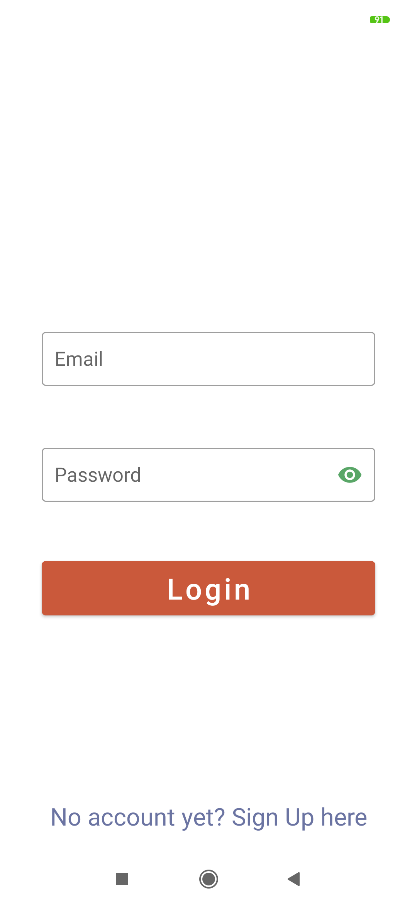
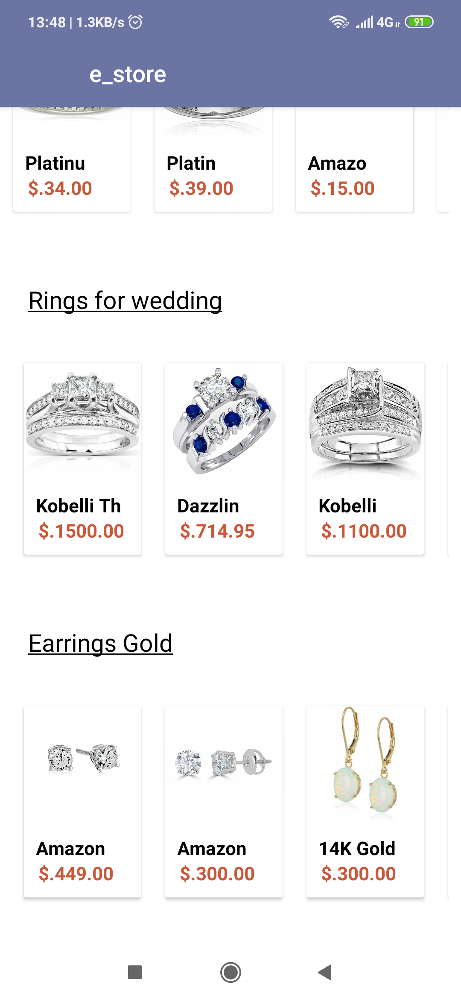
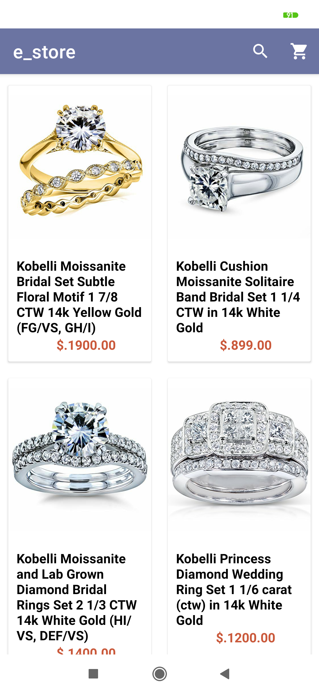
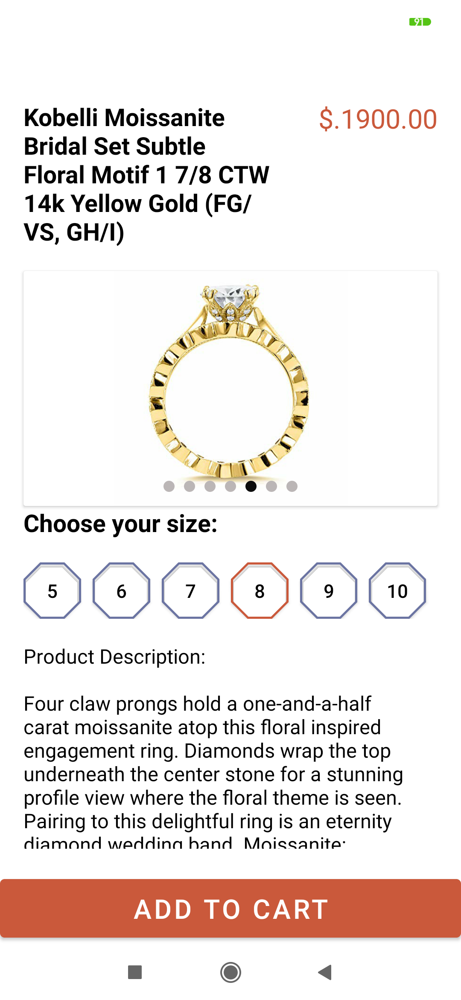
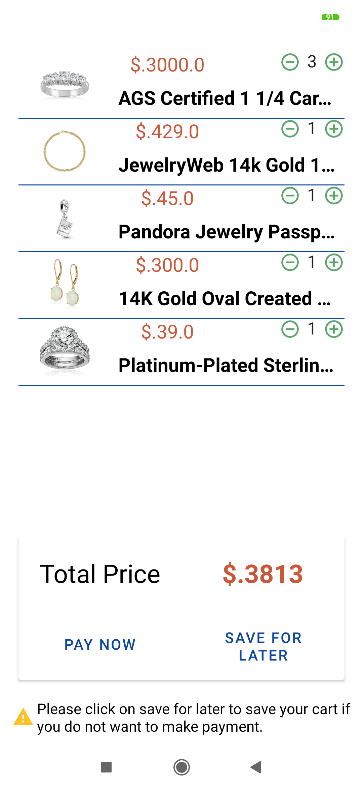
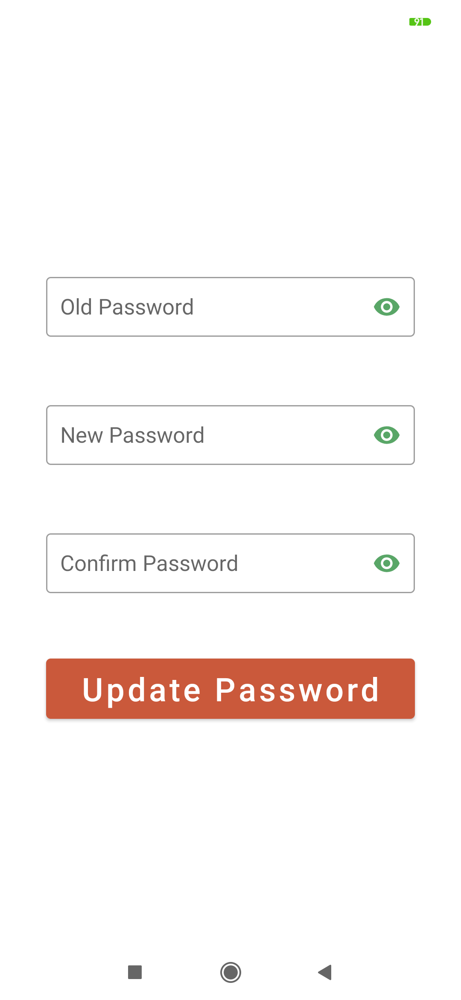
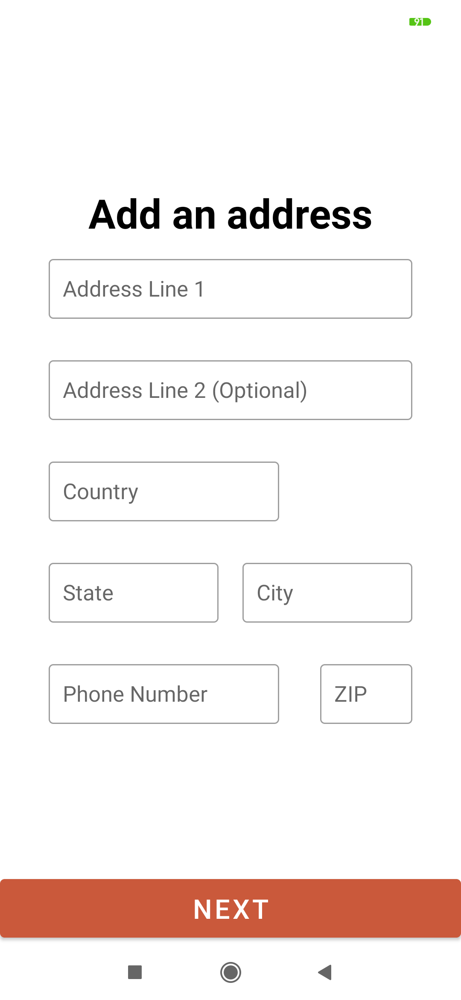
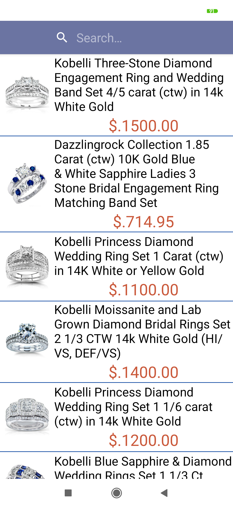

# Jewellery Store

e-commerce Jewelery Store is an an android application implemented using MVVM as Architecture pattern 
, java language for android app and Laravel Framework for Backend REST Api.

## Features:
user can do the following:
- Sign up, log in ,log out and update password.
- Display all products by category.
- Display product's details (name, images, sizes, price and description).
- Search for products by name.
- Add products to the shopping cart on device and save for later on server.
- Display all products in the cart.
- Remove products from cart.
- Add shipping address.
- Make an order.
- Display a list of the user's previous orders.
- Choose payment method and Make the purchase via the 'Braintree' gateway.

## Libraries:
- using [Retrofit](https://square.github.io/retrofit/) for making http requests.
- using [Glide](https://bumptech.github.io/glide/) for loading and displaying images.
- using **Androidx Paging** for loading data by page.
- using [BrainTree](https://www.braintreepayments.com/) gateway for payment.
- using [Android-Image-Slider](https://github.com/smarteist/Android-Image-Slider)
## Api key
you can get api key for testing from [braintreepayments.com](https://www.braintreepayments.com/sandbox) sandbox

##Media:
    
    
    

 
 
 